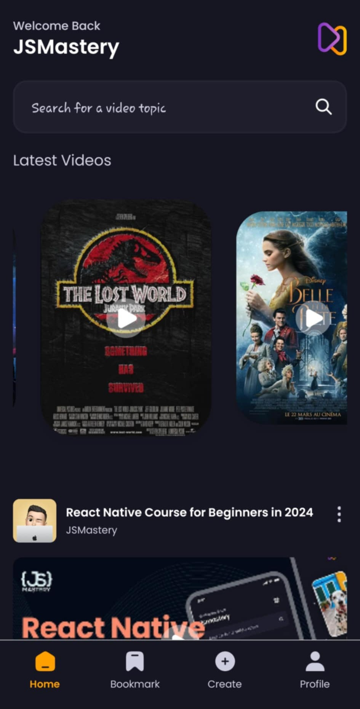
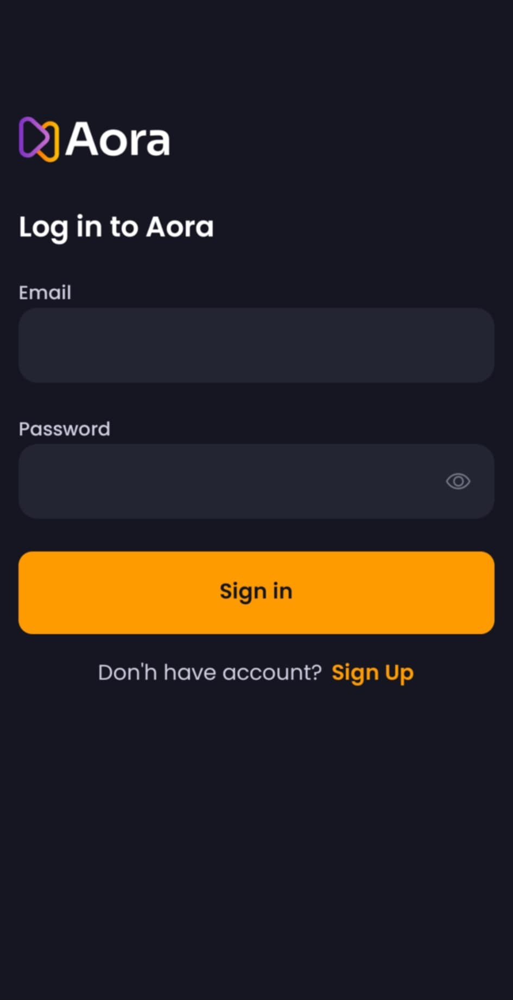
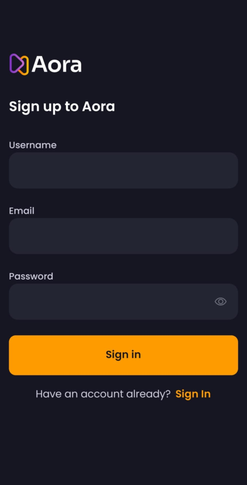
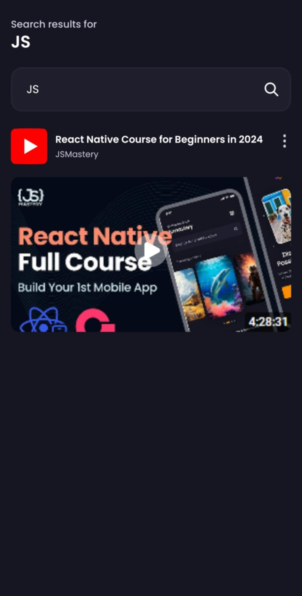
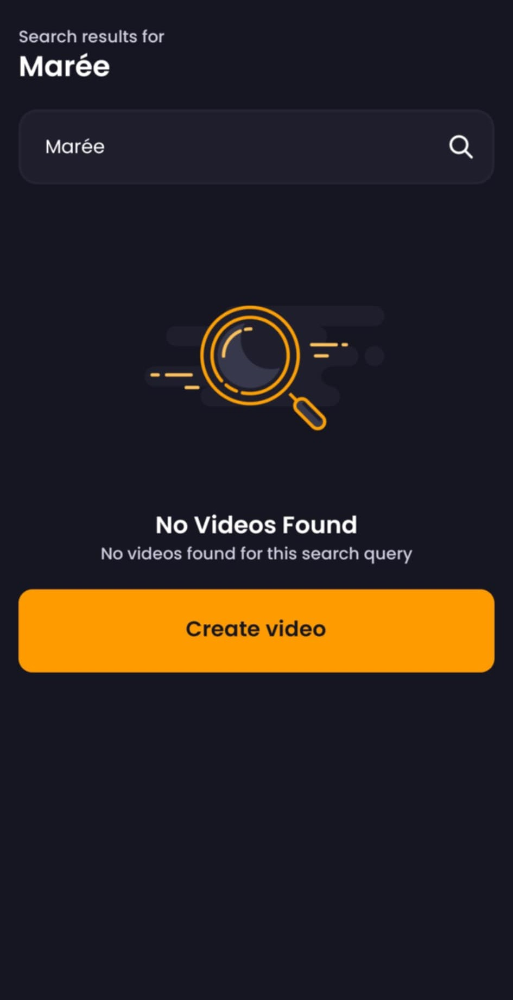
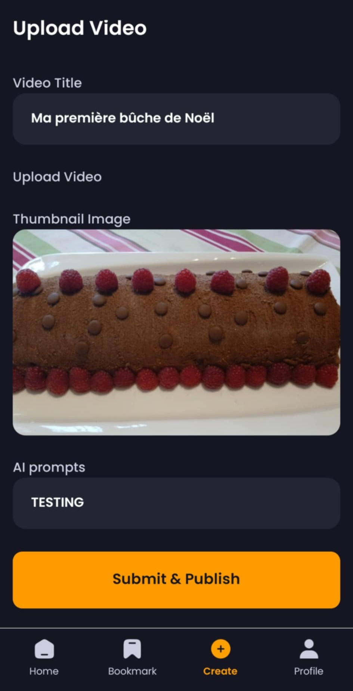

# Apprentissage de React Native: l'application Aora

  

   

Dans ce repo, j'ai pu suivre un tuto sur React Native et Expo à l'adresse [suivante](https://www.youtube.com/watch?v=ZBCUegTZF7M). Le but ici était de créer une application fullstack où l'utilisateur peut se connecter, voir les différentes vidéos disponibles, en ajouter ainsi que de voir les vidéos sauvegardées. Le backend géré via appwrite n'a pas été utilisé ici, j'ai tout fait en local pour mocker les données. Cependant, les scripts backend sont disponibles tout de même dans la codebase.

<h2 align="center">Aperçu des écrans</h2>

<table align="center">
   <tr>
      <th>Ecran d'accueil</th>
      <th>Se connecter</th>
      <th>S'inscrire</th>
   </tr>
   <tr>
      <td align="center"></td>
      <td align="center"></td>
      <td align="center"></td>
   </tr>
</table>

 

<table align="center">
   <tr>
      <th>Recherche de vidéos</th>
      <th>Vidéos non trouvée</th>
   </tr>
   <tr>
      <td align="center"></td>
      <td align="center"></td>
   </tr>
</table>

 

<h2 align="center">Profil utilisateur</h2>

   

 

<table align="center">
   <tr>
      <th>Formulaire de création de posts</th>
      <th>Création d'un post</th>
   </tr>
   <tr>
      <td align="center"></td>
      <td align="center"></td>
   </tr>
</table>

 

<table align="center">
   <tr>
      <th>Confirmation pour sauvegarder une vidéo</th>
      <th>Vidéos sauvegardées</th>
   </tr>
   <tr>
      <td align="center"></td>
      <td align="center"></td>
   </tr>
</table>
