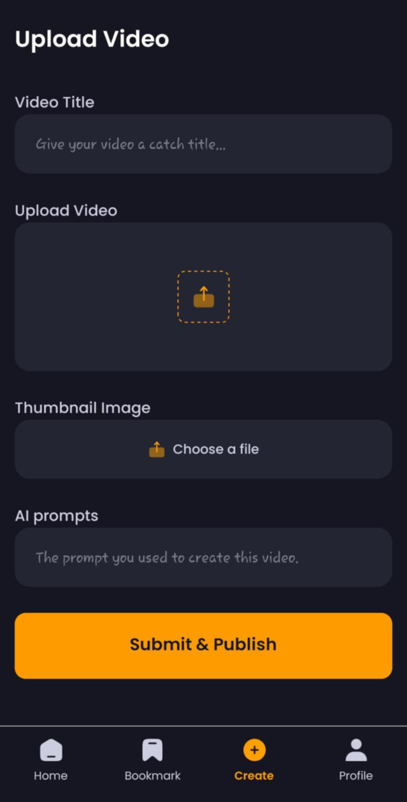

# Apprentissage de React Native: l'application Aora

  

Dans ce repo, j'ai pu suivre un tuto sur React Native et Expo à l'adresse [suivante](https://www.youtube.com/watch?v=ZBCUegTZF7M). Le but ici était de créer une application fullstack où l'utilisateur peut se connecter, voir les différentes vidéos disponibles, en ajouter ainsi que de voir les vidéos sauvegardées. Le backend géré via appwrite n'a pas été utilisé ici, j'ai tout fait en local pour mocker les données. Cependant, les scripts backend sont disponible tout de même dans la codebase.

| Ecran d'accueil                       | Se connecter à l'application        | S'inscrire sur l'application         |
| ------------------------------------- | ----------------------------------- | ------------------------------------ |
|  |  |  |

| Recherche de vidéos                      | Vidéos non trouvée                       |
| ---------------------------------------- | ---------------------------------------- |
|  |  |

| Profil utilisateur                    |
| ------------------------------------- |
|  |

| Formulaire de création de posts           | Création d'un post                        |
| ----------------------------------------- | ----------------------------------------- |
|  |  |

| Confirmation pour sauvegarder une vidéo      | Vidéos sauvegardées                        |
| -------------------------------------------- | ------------------------------------------ |
|  |  |
